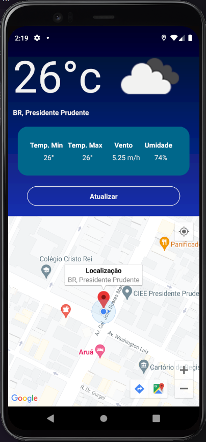

<h1>Resultado Final</h1>

<h1 align="center">
  APP - Weather
  <br /> <br />
  
  <br /> <br />
</h1>

# `Indice`

<a href="#React-Native">1. React-Native</a> <br />
<a href="#Tecnologias-utilizadas">2. Tecnologias utilizadas</a> <br />
<a href="#Como-baixar-o-projeto">3. Como baixar o projeto</a>

## React-Native

Aplicativo que consume a **`localização atual`** do usuário e exiba na interface o endereço atual os dados climáticos da região e um botão para atualizar os dados.

É uma aplicação que se conectar com API **Weather**.
https://openweathermap.org/api

---

## Tecnologias utilizadas

O projeto foi desenvolvido utilizando as seguintes tecnologias:

- React-Native
- Expo
- TypeScript
- Axios

---

## Como baixar o projeto

```bash

  # Clonar o repositório
  $ git clone git@github.com:DevTeles/challenge-builders.git

  # Entrar no diretório
  $ cd challenge-builders

  # Instalar as dependências
  $ yarn

  # Iniciar o projeto
  $ expo start

  # Escolher android ou ios
  $ expo start --android
  # ou
  $ expo start --ios
```

<br /><br />
Desenvolvido por **Rafael Teles Vital**
